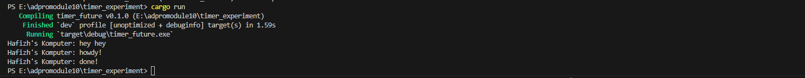
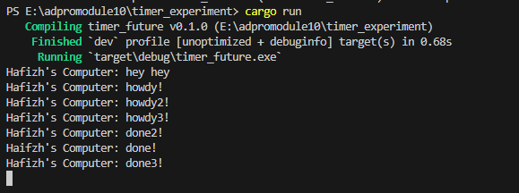
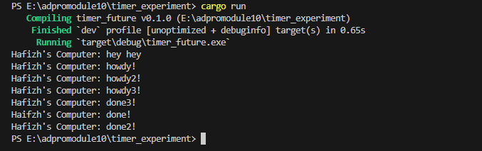

# Module 10

Hafizh Surya Mustafa Zen 2306256343

## 1.2 Understanding how it works.

### The screenshot

When spawner.spawn(async { ... }) is called, the async task gets added to a queue but doesn’t start right away. Meanwhile, the synchronous line println!("Brian's Komputer: hey hey"); runs immediately, so “hey hey” is printed first—before the executor even starts polling the task. The actual execution begins only after the spawner is dropped and executor.run() is called.

Inside the executor’s loop, the task is polled for the first time, which prints “howdy!” and sets a 2-second timer, then returns Poll::Pending. When the timer completes, it re-schedules the task, and on the second poll, the future finishes and prints “done!”. This explains why you see the output in that specific order: the sync print happens first, followed by the async prints during the task's two-stage execution.

## 1.3 Mutiple Spawn and removing drop

### Before Removing drop(spawner)

When spawner.spawn(async { ... }) is called, the async task gets queued but doesn’t start right away. The next line, println!("Brian's Komputer: hey hey");, runs immediately and prints “hey hey”. The task only starts once the spawner is dropped and executor.run() is called. This triggers the executor to begin polling the queued tasks, resulting in the output: "hey hey" → "howdy!" → wait → "done!".

### After Removing drop(spawner)

If you don’t explicitly drop the spawner, the behavior changes. Since the spawner holds the sending side of the channel, the executor won’t know when to stop—it keeps waiting for new tasks. This means even after queued tasks finish running and output is correctly produced, the executor hangs because the channel remains open. The tasks still run, but the program doesn’t exit on its o